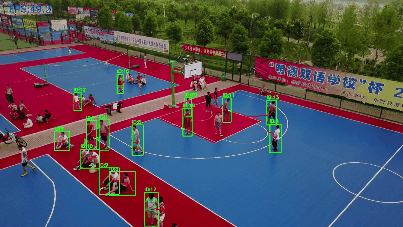
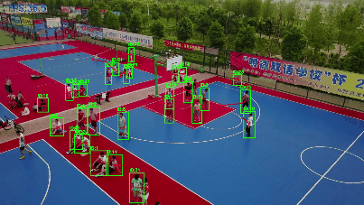

# Real-Time UAV Person Detection and Tracking using YOLO11s + ByteTrack

## 1. Dataset Description

Dataset used:

**VisDrone2019-MOT**

The dataset contains UAV videos captured from different scenes, heights and viewpoints.

For this project the detection task was converted into YOLO format.

Selected categories:

- pedestrian
- people

Objective:

Detect small-scale persons from aerial imagery and perform real-time multi-object tracking.

---

# 2. Model Resolution Benchmarking

Notebook:

`01_model_resolution_benchmark.ipynb`

Multiple detectors were benchmarked at different input resolutions.

Models evaluated:

- YOLOv8
- YOLO11
- RT-DETR

Resolutions:

- 640
- 960
- 1120
- 1280

## Detection Benchmark Results

| Model | Resolution | FPS | Precision | Recall | mAP50 | mAP50-95 |
|-|-|-|-|-|-|-|
|YOLOv8s|1280|49.67|0.627|0.560|0.478|0.191|
|YOLOv8m|1280|25.95|0.637|0.580|0.492|0.201|
|YOLOv8l|1280|18.07|0.685|0.551|0.479|0.201|
|YOLO11s|1280|48.95|0.619|0.502|0.433|0.176|
|YOLO11m|1280|28.06|0.597|0.547|0.468|0.192|
|YOLO11l|1280|23.47|0.601|0.576|0.495|0.208|
|RT-DETR-R18|960|18.38|0.410|0.621|0.462|0.189|

YOLO11s-1280 was selected because it provided the best trade-off between:

- real-time speed
- model size
- small object detection capability

---

# 3. Detector + Tracking Algorithm Comparison

Notebook:

`02_tracking_comparison.ipynb`

Trackers evaluated:

- ByteTrack
- BoT-SORT
- BoT-SORT + Global Motion Compensation

## Tracking Speed Comparison

|Detector|Tracker|FPS|
|-|-|-|
|YOLO11s-1280|ByteTrack|36.56|
|YOLO11s-1280|BoT-SORT No-GMC|32.25|
|YOLO11s-1280|BoT-SORT GMC|4.18|
|YOLO11m-1280|ByteTrack|22.51|
|YOLO11l-1280|ByteTrack|18.66|
|RT-DETR-960|ByteTrack|14.12|

Observation:

ByteTrack achieved the best real-time performance.

GMC improves camera motion handling but introduces significant computational overhead.

---

# 4. YOLO11s Fine-Tuning

Notebook:

`03_yolo11s_finetuning.ipynb`

Selected model:

YOLO11s @ 1280

Training setup:

- COCO pretrained weights
- AdamW optimizer
- Mixed precision training
- Mosaic augmentation
- Early stopping

Hardware:

NVIDIA RTX 4050 Laptop GPU (6GB)

Training outputs:

- Precision-Recall curves
- Confusion matrix
- Validation metrics

---

# 5. Fine-Tuned YOLO11s + Tracking Evaluation

Notebook:

`04_finetuned_tracking.ipynb`

The fine-tuned detector was evaluated with ByteTrack and BoT-SORT.

## Tracking Results

| Pipeline | FPS | MOTA | IDF1 | Mostly Tracked | Mostly Lost | Precision | Recall |
|-|-|-|-|-|-|-|-|
|YOLO11s Base + ByteTrack|26.18|0.264|0.338|12|51|0.746|0.419|
|YOLO11s FT + ByteTrack|26.48|0.293|0.395|31|20|0.667|0.618|
|YOLO11s FT + BoT-SORT GMC|8.14|0.239|0.385|7|93|0.795|0.328|

Fine-tuning improvements:

### Recall

0.419 → 0.618

### IDF1

0.338 → 0.395

### Mostly Tracked Objects

12 → 31

The fine-tuned model detects more small UAV persons while maintaining real-time FPS.

---

# 6. ONNX Export and Deployment Testing

Notebook:

`05_ONNX_deployment.ipynb`

The fine-tuned YOLO11s model was exported into ONNX format.

Runtime:

ONNX Runtime GPU

Providers:

- TensorRTExecutionProvider
- CUDAExecutionProvider
- CPUExecutionProvider

## ONNX Benchmark

|Metric|Value|
|-|-|
|Average Latency|43.8 ms|
|Average FPS|22.83|
|Best FPS|27.55|

## Model Size

|Format|Size|
|-|-|
|PyTorch (.pt)|18.34 MB|
|ONNX (.onnx)|36.65 MB|

---

# Complete Pipeline

UAV Frame

↓

YOLO11s Fine-Tuned Detector

↓

ByteTrack Association

↓

Tracked Persons with IDs

---

# Demo

Base Model Tracking:

`demo/YOLO11s_Base_ByteTrack.mp4`

Fine-Tuned Model Tracking:

`demo/YOLO11s_FT_ByteTrack.mp4`
## Tracking Demo

### YOLO11s Base + ByteTrack

### Fine-tuned YOLO11s + ByteTrack

# Key Results

- Real-time UAV tracking pipeline
- Recall improved from 0.419 → 0.618
- IDF1 improved from 0.338 → 0.395
- Maintained ~26 FPS tracking speed
- ONNX deployment tested at 22.83 FPS
